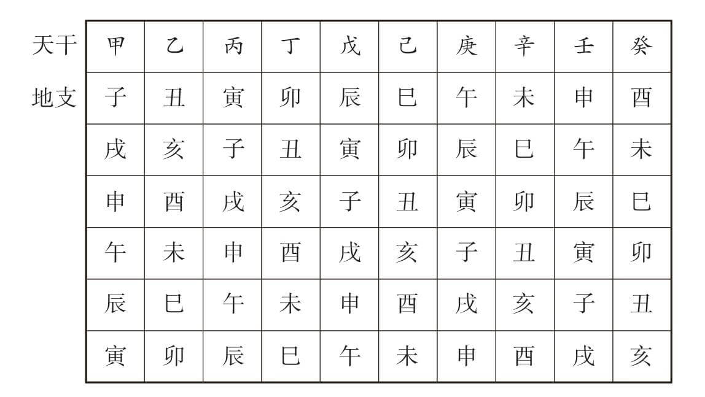
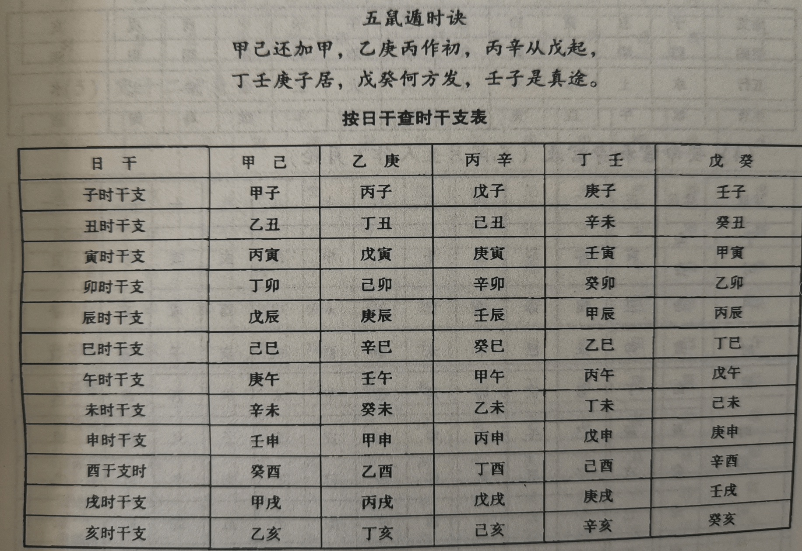

# 玄学基础

## 阴阳

## 五行

相生顺序：木火土金水

## 十天干

1 2 3 4 5 6 7 8 9 0

甲乙丙丁戊 己庚辛壬癸


**天干五行歌诀：**

- 甲乙东方青龙木
- 丙丁南方朱雀火
- 戊己中央苍龙土
- 庚辛西方白虎金
- 壬癸北方玄武水

### 天干合化

天干是隔 5 合化，从 1-5 是相生的关系
土生金，金生水，水生木，木生火

- 甲己合化土，1、6
- 乙庚合化金，2、7
- 丙辛合化水，3、8
- 丁壬合化木，4、9
- 戊癸合化火，5、0

## 十二地支

子丑寅卯辰巳午未申酉戌亥

木：寅卯
火：巳午
土：辰戌丑未
金：申酉
水：亥子

## 六十甲子

天干地支两两相配，初始第一位天干为甲，地支为子
首年为甲子年，之后为乙丑，在之后丙寅，依次后排

但天干有 10 个，地支有 12 个明显不够分，这时候就是各轮各的
天干最后一位为癸，此时地支为酉，下一步天干从甲开始，地支继续为戌

天干为 10，地支为 12，他们的最小公倍数是 60，也就是从第一个甲子年，到下一个甲子年，中间间隔 60 年，如下图：



月份和时辰也是按这个顺序组合

月份的话**正月建寅**，其他往后推

- 子月：十一月
- 丑月：十二月
- 寅月：一月
- 卯月：二月
- 辰月：三月
- 巳月：四月
- 午月：五月
- 未月：六月
- 申月：七月
- 酉月：八月
- 戌月：九月
- 亥月：十月

为什么不以子月为一月呢？这是因为汉武帝为了更好地配合农耕，将立春定为每年之始，立春的时候是寅月，所以就将一年之始的寅月定为一月

- 子时：23—1 点
- 丑时：1—3 点
- 寅时：3—5 点
- 卯时：5—7 点
- 辰时：7—9 点
- 巳时：9—11 点
- 午时：11—13 点
- 未时：13—15 点
- 申时：15—17 点
- 酉时：17—19 点
- 戌时：19—21 点
- 亥时：21—23 点

如果按地支来算，一天是以 23 点为开始

## 干支纪年

### 年转化

阳历年转换天干：

```
（年份 - 3） 取余 10
```

如 2023 年，2023 - 3 = 2020，再用 2020 取余 10，得到 0
此时这个数字从甲开始数，第几位就是谁，0 则为癸
所以 2023 年天干为癸

阳历年转换地支：

```
年份 - 3 % 12
```

如 2023 年，2023 - 3 = 2020，再用 2020 取余 12，得到 4
此时这个数字从子开始数，第几位就是谁，0 则为亥，4 为卯
所以 2023 年地支为卯，为癸卯年

### 月转化

月的地支是固定的，以正月建寅往后推
需要注意的是，月的干支是以立春为始

```
月的天干＝(该年的尾数＋2)×2＋所求月数＝(1＋2)×2＋6＝2(取尾数)
```

比如 2023 年 1 月，2023 尾数为 3，3+2=5 5\*2=10 10+1=11 取尾数为 1，也就是甲

但需要注意，2023 年的立春是在阳历 2 月 4 日，也就是 2023 年 2 月 4 日之后，正月建寅，才是正经的一月，也就是甲寅月

甲的前一位是癸，寅的前一位为丑，所以在此之前的阳历 1 月，实际为癸丑月，等立春后正式成为甲寅月，之后每隔 2 个节气，也就是 30 天转换一次月份

4 + 30 天后，也就是 3 月 6 日惊蛰，为乙卯月

在过 30 天，也就是 4 月 5 日，为丙辰月，依次类推

最简单还是直接看日历

### 时的天干

以当日的干查此表，可得出对应时的干



## 七曜

日、月、金星、水星、木星、火星、土星

## 八门

休生伤杜，景死惊开

## 九星

天蓬星、天芮星、天冲星、天辅星、天禽星、天心星、天柱星、天任星、天英星

## 十二长生

长生、沐浴、冠带、临官、帝旺、衰、病、死、墓、绝、胎、养

四旺运：长生、冠带、临官、帝旺

四平运：衰、病、胎、养

四恶运：沐浴、死、墓、绝

## 二十四节气

正月：

- 立春
- 雨水

二月：

- 惊蛰
- 春分

三月：

- 清明
- 谷雨

四月：

- 立夏
- 小满

五月：

- 芒种
- 夏至

六月：

- 小暑
- 大暑

七月：

- 立秋
- 处暑

八月：

- 白露
- 秋分

九月：

- 寒露
- 霜降

十月：

- 立冬
- 小雪

冬月：

- 大雪
- 冬至

腊月：

- 小寒
- 大寒
