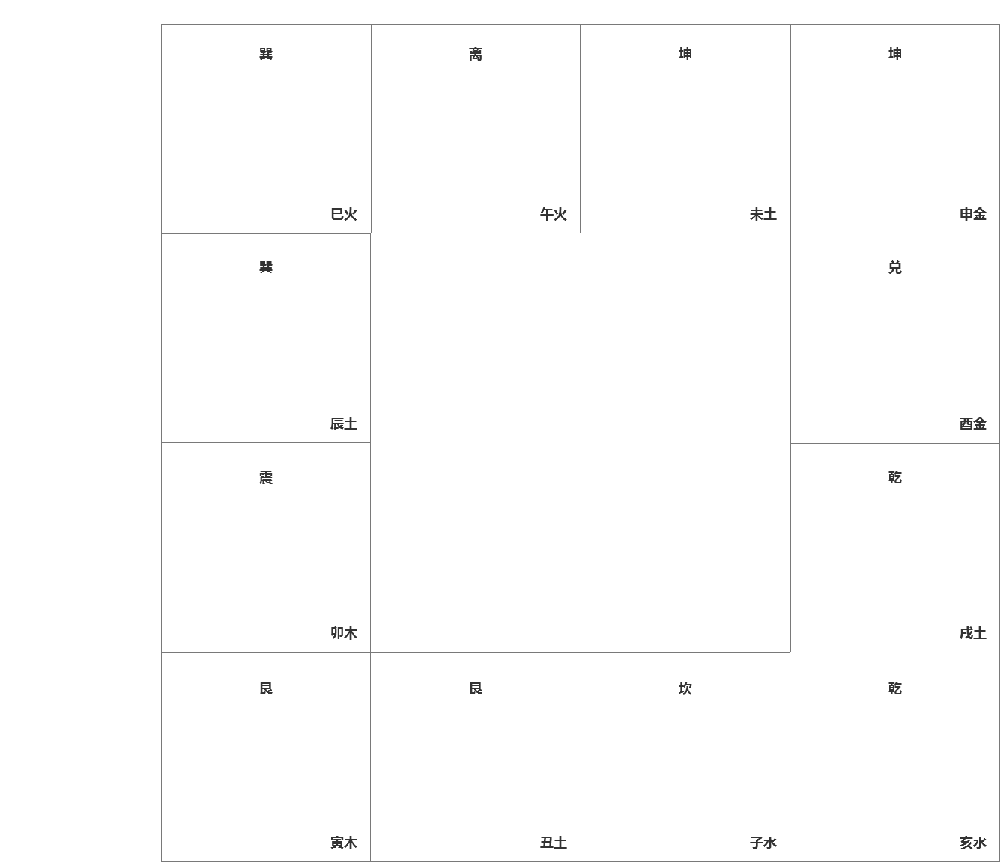
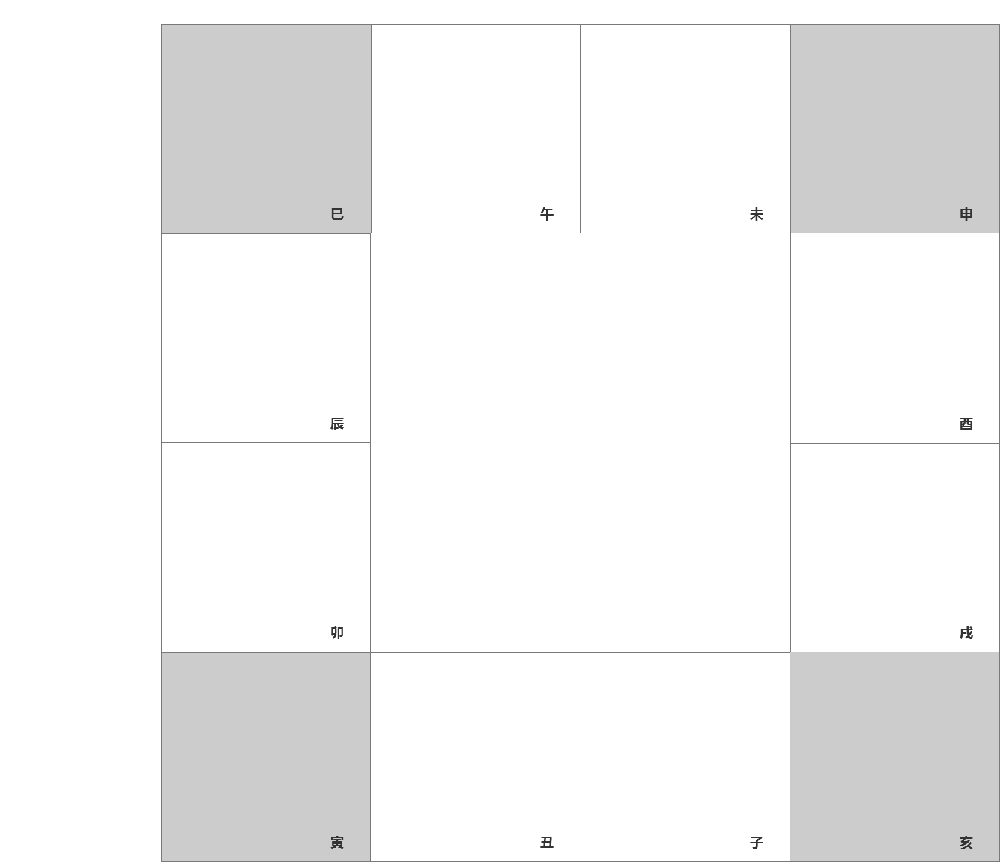
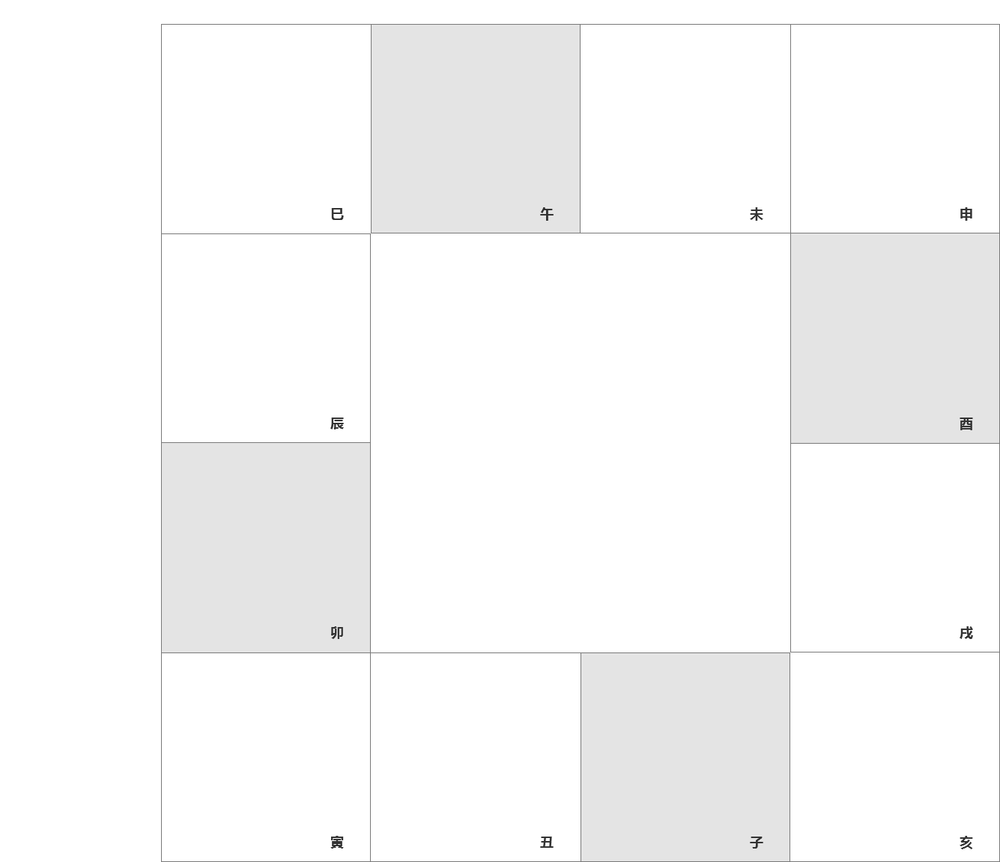
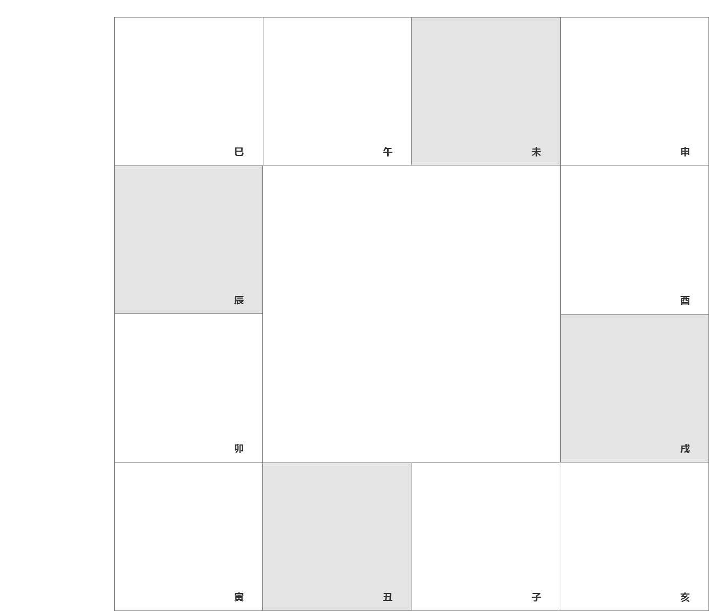

# 紫微斗数

## 基础

**命盘与八卦五行**

### 四凶、六煞、七吉

- 四凶：擎羊、陀螺、火星、铃星
- 六煞：上面四个加上地空、地劫
- 七吉：文昌、文曲、左辅、右弼、天魁、天钺、禄存

### 四马之地

指寅、申、巳、亥四个宫，天马只会在这四个宫中

同时也是长生十二神顺行之“长生所在”，也叫**四生之地**

此四宫受天马星奔波劳碌影响，故这四宫主劳碌，奔波，易自寻烦恼

### 四败之地

子、午、卯、酉是咸池和沐浴等桃花星所入之宫，所以叫四败之地，或桃花之地，这四宫主恶，主交友、游乐、风流、酒色、多才多艺，感情不稳定等

### 四墓之地

辰、戌、丑、未是长生十二神顺行之“墓”所在，所以叫四墓之地

孤辰、寡宿只进这四宫，这四宫主刑、主孤独，六亲缘薄，适合去外地发展

同时也叫四库之地：

- 丑宫为金库（巳酉丑，三合金局）
- 未宫为木库（亥卯未，三合木局）
- 辰宫为水库（申子辰，三合水局）
- 戌宫为火库（寅午戌，三合火局）

### 天罗地网

- 辰宫：天罗
- 戌宫：地网

此二宫主困

### 雷门

卯宫居东，在震位，震为雷，所以叫雷门

### 天门

亥宫为天门，此宫相对不怕凶星侵犯

> 诸星会恶，朝天反吉

### 地门

巳宫为地门，天地相对

### 人门

寅宫

### 鬼门

申宫

### 空门

戌亥

### 定生时

1. 通过睡觉姿势

- 子、午、卯、酉喜欢仰躺着睡
- 寅、申、巳、亥喜欢侧着睡
- 辰、戌、丑、未喜欢趴着睡

2. 小手指长度与无名指指纹

- 子、午、卯、酉小手指高于无名指指纹
- 寅、申、巳、亥小手指平于无名指指纹
- 辰、戌、丑、未小手指低于无名指指纹

3. 头旋

- 子、午、卯、酉头旋正中
- 寅、申、巳、亥头旋偏左
- 辰、戌、丑、未头旋偏右，且多旋

4. 相貌特征

- 子、午、卯、酉神清目秀，面圆身圆，圆形脸
- 寅、申、巳、亥体态丰满，声粗性急，方形脸
- 辰、戌、丑、未

以上几点不能单一去看，综合取相似处最多的，同时排盘后还需校验，用命宫主星来看性格长相，以及一些过往事件是否符合
                                                                                                              