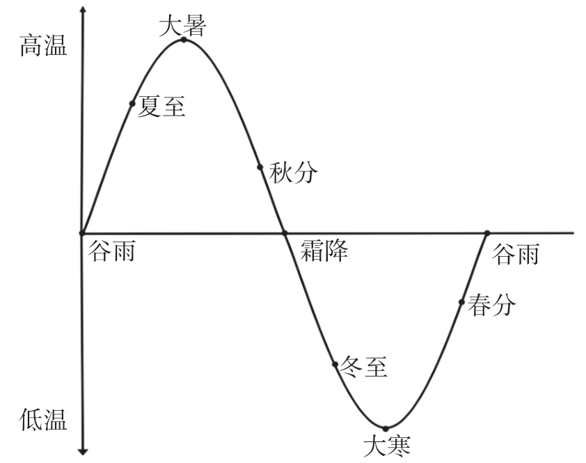

# 中医

## 基础

### 五运六气

#### 六气

风、热、暑、湿、燥、寒

**厥阴风木**

大寒到春分前

地下水经一整个冬天的封藏，其能量开始向上散发到地面，所以地面天气由寒转温，能量从封藏到散发的过程是一个能量疏泄的过程，是为五行之木

疏泄若不通则形成风，所以又称为风木

天气特点是温和风

**少阴君火**

春分到小满前

天气从温转热，天气特点就是热

**少阳相火**

小满到大暑前

热极生寒是说温度高到极点后就会降低，这个极点就是大暑

在大暑时，地面的温度最高，地下的温度最低，阳气也最少，所以叫少阳，少阳相火主气时，天气特点为暑热

**太阴湿土**

大暑到秋分前

阳气开始从地面敛降到地下，而暑气随着天气变凉而化水于地上，故为水湿，太阴湿土的天气特点是有湿气，

**阳明燥金**

秋分至小雪前

地面阳气越来越少，温度也越来越低，而地面的湿气也被敛收于地下，故地面干而为燥

阳明燥金主气时，天气特点为凉和燥

**太阳寒水**

小雪到大寒前

太阳寒水主气时，天气特点是寒

六气按时间发展轮替，使得一年之间有春夏秋冬，其实一年分成六个季节是最好的，只是人们感受最深的还是温度的变化，所以才为四季

**脏为阴，腑为阳**

肝胆：肝为阴，胆为阳
脾胃：脾为阴，胃为阳
